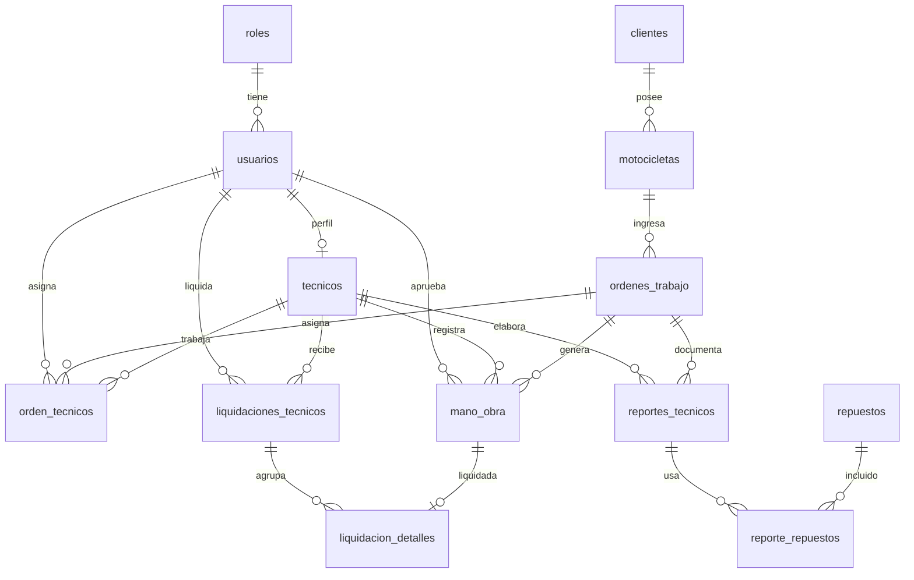

# FASE 2 — Modelo de Base de Datos

## 1. Relación entre tablas

- Un **rol** tiene muchos **usuarios**.
- Un **usuario** con rol TECNICO tiene un perfil en **tecnicos** (1:1).
- Un **cliente** tiene muchas **motocicletas**.
- Una **motocicleta** tiene muchas **órdenes de trabajo** (cada ingreso es una orden).
- Una **orden** puede tener varios **técnicos** (`orden_tecnicos`).
- Una **orden** tiene muchas **manos de obra** y muchos **reportes técnicos**.
- Un **reporte** usa muchos **repuestos** (`reporte_repuestos`).
- Una **liquidación** agrupa varias manos de obra (`liquidacion_detalles`) para no pagar dos veces.

## 2. Diagrama Entidad-Relación

## 3. Decisiones de diseño

- La moto **no** guarda el nombre del dueño: solo `id_cliente`.
- El historial se consulta uniendo órdenes + técnicos + M/O + reportes + repuestos.
- `liquidacion_detalles.id_mano_obra` es UNIQUE: una M/O no se liquida dos veces.
- `mano_obra.id_liquidacion` refuerza el mismo control.
- Porcentaje del técnico vive en `tecnicos`, no se copia en cada orden.
